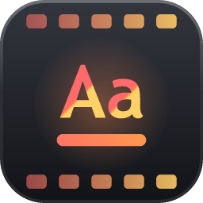
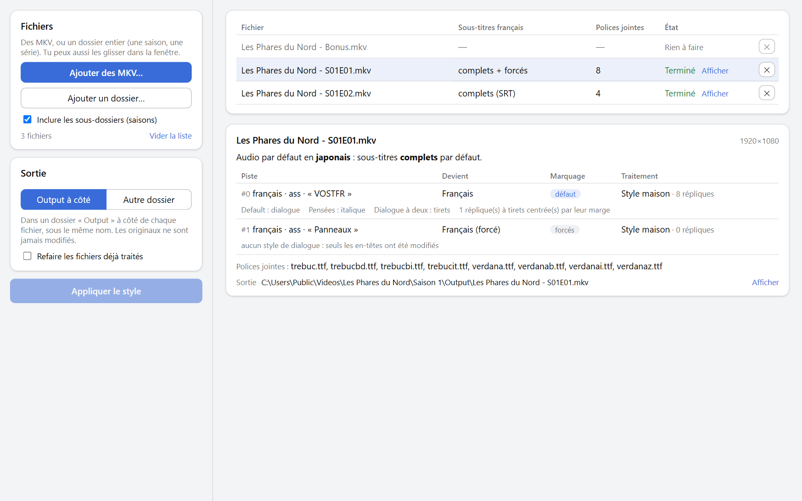
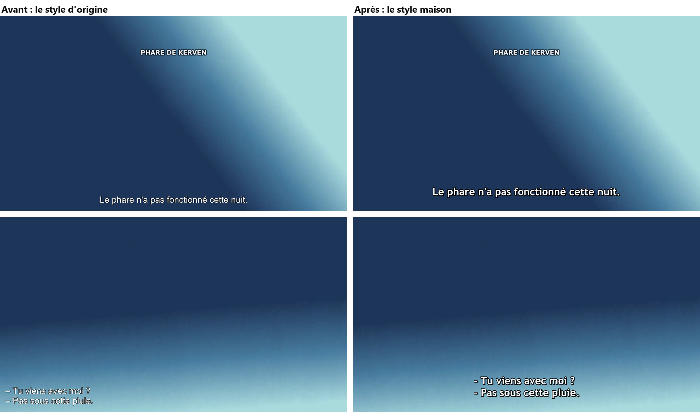

English | <a href="README.fr.md">Français</a>

  

<h1 align="center">Bobine Style</h1>

  <b>One clean, readable style for the French subtitles of your MKV files</b>, at the right size on every video.

  
  
  
  
  

  

<picture>
  <source media="(prefers-color-scheme: dark)" srcset="docs/screenshots/main-dark.png">
  
</picture>

## Why

French subtitles come in every style: thin Arial from one source, a huge font from another, a dialogue track that's hard to read on a bright scene. Across a library, it's a patchwork. Restyling them by hand means opening each file in a subtitle editor, finding which style is the dialogue, which one the italics, leaving the signs alone, then remuxing.

Bobine Style does all of that in one pass, for a file or a whole series, and labels the tracks so that Plex (or any player) picks the right one on its own.

It's part of **Bobine**, a small suite of tools for a video library, next to [SyncAudio](https://github.com/MarcValat/SyncAudio) and [SyncSubtitles](https://github.com/MarcValat/SyncSubtitles). The interface is in French.

## Features

- 🎨 **One house style**: Trebuchet MS bold, white with a black outline and shadow, with its variants: italics, top of the screen, two-speaker dash lines (centred, dashes aligned), simultaneous speech in yellow.
- 📐 **The right size on every video**: the style is defined for a 1080p screen and scaled to each video: same size in 720p as in 4K, and a scope (2.39:1) or 4:3 film keeps the same on-screen size as a 16:9 one.
- 🔍 **Roles found from usage, not names**: which style is the dialogue, the italics, the top lines… is worked out from how each style is used, whatever it's called. Signs and typesetting are left exactly as they were.
- 🏷️ **Full and forced tracks named and flagged**: *Français* and *Français (forcé)*. The default subtitle follows the default audio: forced with French audio, full otherwise.
- 🔤 **Fonts attached**: Trebuchet MS and the fonts the signs use are attached to the MKV, so the subtitles look the same on any player.
- 📝 **SRT too**: French SRT files are converted to ASS in the same style (italics, `{\an8}`, dash lines…).
- 🗂️ **A whole series in one pass**: drop a folder, its seasons are included; files already done are skipped.
- 🛡️ **Nothing lost**: video, audio, other languages' subtitles and chapters are copied untouched, nothing is re-encoded, the original file is never changed, and each output is checked before it's kept.

## Install

**Windows 10 and 11:**

1. Download `Bobine Style_x.y.z_x64-setup.exe` from the [latest release](https://github.com/MarcValat/BobineStyle/releases/latest).
2. Run it. The installer isn't signed with a certificate, so Windows SmartScreen may say *"Windows protected your PC"*: click **More info**, then **Run anyway**.

**Linux** (Ubuntu 22.04 or newer, Debian and their derivatives):

1. Download `Bobine Style_x.y.z_amd64.deb` from the [latest release](https://github.com/MarcValat/BobineStyle/releases/latest).
2. Install it from its folder with `sudo apt install "./Bobine Style_x.y.z_amd64.deb"`, then start it from the applications menu.
3. Trebuchet MS isn't part of Linux: install it (`sudo apt install ttf-mscorefonts-installer`) so it can be attached to the files.

The engine and ffmpeg come with the app. When a new version comes out, the app offers it and installs it in one click.

## How it works

1. **Add MKV files**, or a whole folder (a season, a series), with the buttons or by dropping them on the window.
2. **Check** what will be done: click a file to see each subtitle track's fate, the default track and the fonts to attach.
3. **Apply the style**: the new files go into an `Output` folder next to the originals (or a folder of your choice), under the same names.

📖 The [user guide](docs/guide.md) explains everything in detail: the house style, how roles are found, the default track, FAQ.

## Good to know

- Only **French** subtitle tracks are restyled (`fre`, or an undetermined track when the file has no French one). Other languages are kept as they are.
- Tracks made only of signs (a "Signs" track) are flagged forced but not restyled: their typesetting is kept as designed.
- Some TV apps (Plex on some smart TVs, for instance) turn ASS subtitles into plain text and ignore any style: nothing a file can change. The style shows on players that render ASS (Plex on a computer, Infuse, VLC, mpv, Kodi), and when the Plex server burns the subtitles into the picture.

## For developers

- [`engine/`](engine/README.md): the Python engine (reading tracks, finding roles, styling, SRT conversion, remuxing, local HTTP server); usable on its own as a command line tool.
- [`app/`](app/README.md): the app (Tauri + React/TypeScript), which drives the engine; building, packaging and publishing a release.

## License

Copyright © 2026 Marc Valat. Bobine Style is free software, released under the [GNU General Public License v3](LICENSE): you may use, study, share and modify it, and any version you distribute, modified or not, must stay under the same license with its source code available.

The installer also ships [FFmpeg](https://ffmpeg.org/) (a [gyan.dev](https://www.gyan.dev/ffmpeg/builds/) build, through [imageio-ffmpeg](https://github.com/imageio/imageio-ffmpeg)), which Bobine Style runs as a separate program. That build is also under the GPL v3; its source code is available from FFmpeg and gyan.dev.

No font is shipped: Trebuchet MS and the others are taken from your computer and attached to your own files.
